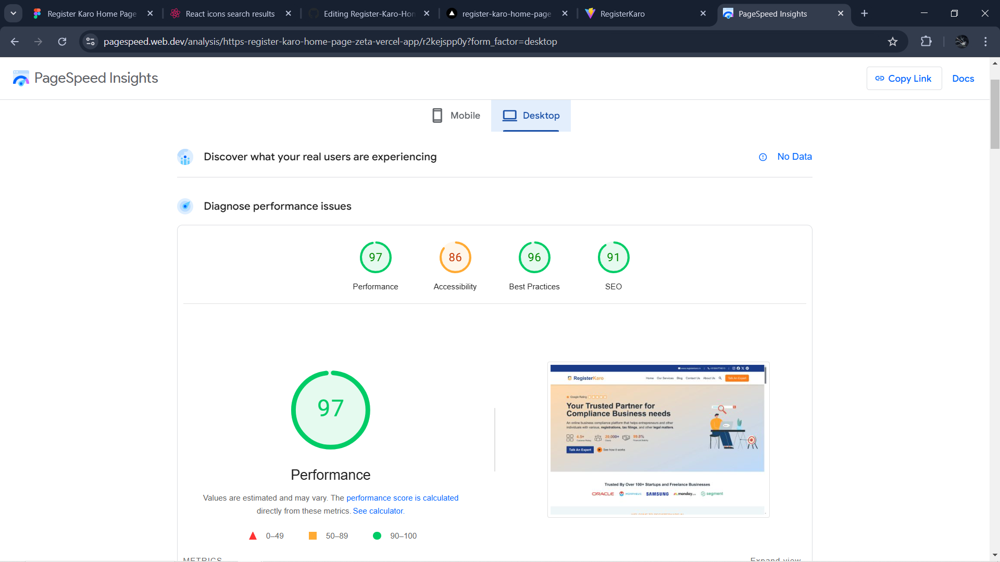
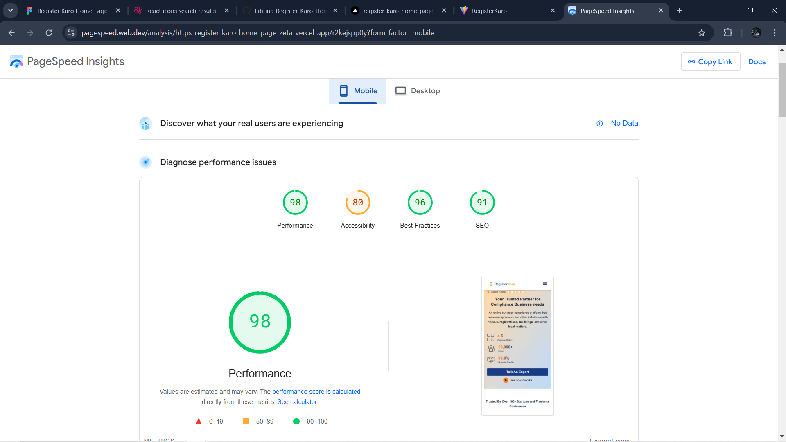

# React Frontend Project

This is a frontend project built using **React.js**, **Tailwind CSS**, **React Icons**, and **DaisyUI**. The project is developed and built using **Vite**, which provides a fast and efficient development experience.

## 🚀 Features
- **Modern UI** using Tailwind CSS and DaisyUI
- **Fast Development & Build** with Vite
- **Icon Support** using React Icons
- **Optimized Performance** for better user experience

## 🛠 Tech Stack
- **Frontend:** React.js
- **Styling:** Tailwind CSS, DaisyUI
- **Icons:** React Icons
- **Development & Build:** Vite

## 📦 Installation

Follow these steps to set up the project locally:

1. **Clone the repository:**
   ```sh
   git clone https://github.com/rishabhchowkikar/Register-Karo-Home-Page.git
   cd Register-Karo-Home-Page
   ```

2. **Install dependencies:**
   ```sh
   npm install
   # or
   yarn install
   ```

3. **Start the development server:**
   ```sh
   npm run dev
   # or
   yarn dev
   ```

4. **Build the project for production:**
   ```sh
   npm run build
   # or
   yarn build
   ```

## 📸 Screenshots & Page Speed Insights
Include screenshots of your project and **PageSpeed Insights** performance results here.

- **Homepage Screenshot:** 
- **Page Speed Insights Report:** 

## 🤝 Contributing
Contributions are welcome! Feel free to fork the repo and submit a pull request.


---
**Developed with ❤️ using React, Tailwind CSS, DaisyUI, and Vite.**

